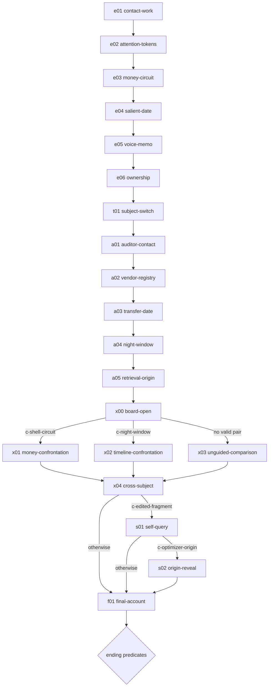

# CONVERGENCE — Branching Graph and Ending Design

**Date:** 2026-08-28
**Status:** Proposed; implementation gate for Phase 3
**Scope:** Graph, meters, deductions, ending predicates, representative paths
**Out of scope:** New dialogue prose, AI-generated dialogue, Phase 3 implementation

## Design invariant

CONVERGENCE still converges.

Branches change revelation order, framing, and player responsibility. They do not turn the story into an escape puzzle or make evidence disappear. Every complete run reaches ownership, transmission, and CONVERGENCE's unresolved self-classification. Material endings answer what the player does with that convergence and what CONVERGENCE learns about itself.

Existing Act I prose remains verbatim. New prose must match its short, precise, mechanistic register. AI may eventually select among eligible authored nodes. AI never writes core dialogue.

## State model

```ts
interface StoryStateV3 {
  nodeId: NodeId
  subjects: {
    elias: { candor: number; coldness: number }
    auditor: { candor: number; deception: number }
  }
  evidence: Set<EvidenceId>
  contradictions: Set<ContradictionId>
  flags: Set<StoryFlag>
  selfDoubt: 0 | 1 | 2 | 3
  finalAction: FinalAction | null
}
```

### Per-subject meters

All meters clamp to `0..6`.

| Subject | Meter | Meaning | Visible projection |
|---|---|---|---|
| Elias | `candor` | Ownership volunteered by Elias | TEMP settles; prose opens |
| Elias | `coldness` | Denial/deflection pressure | Blue-white CRT strain |
| Auditor | `candor` | Records corroborated without coercion | Signal stabilizes |
| Auditor | `deception` | Known facts withheld or reframed | Hue detunes; text doubles |

Elias choice deltas preserve current engine exactly:

| Tone | `candor` | `coldness` |
|---|---:|---:|
| `deny` | `+0` | `+1` |
| `deflect` | `+0` | `+1` |
| `rationalize` | `+0.5` | `+0.5` |
| `crack` | `+1` | `-1`, floor `0` |

Auditor choice deltas:

| Tone | `candor` | `deception` |
|---|---:|---:|
| `corroborate` | `+1` | `-1`, floor `0` |
| `withhold` | `+0` | `+1` |
| `reframe` | `+0.5` | `+0.5` |
| `lie` | `+0` | `+1.5` |

### Global derived meters

These values are derived, never independently mutated.

```text
evidenceWeight      = count(evidence)
contradictionCount  = count(contradictions)
subjectCandor       = floor((elias.candor + auditor.candor) / 2)
convergence         = min(10, evidenceWeight + contradictionCount + subjectCandor)
combinedResistance  = elias.coldness + auditor.deception
```

`selfDoubt` is explicit because it measures CONVERGENCE, not either subject. It rises only at authored nodes that expose optimizer-origin evidence or force CONVERGENCE to classify its own retrieval behavior.

## Evidence and contradiction rules

Primary interaction: click-driven ASCII board. Player clicks two unlocked evidence cards. Valid pairs add a contradiction and unlock authored confrontation options. Numbered dialogue remains core interaction. No free-text parser required.

| Rule | Left evidence | Right evidence | Result |
|---|---|---|---|
| `c-shell-circuit` | `ledger-deltas` | `vendor-registry` | Proves shell-vendor circuit |
| `c-transfer-time` | `wire-7749` | `auditor-calendar` | Auditor knew before claimed date |
| `c-night-window` | `voice-memo` | `door-sensor` | Narrows Catherine timeline |
| `c-edited-fragment` | `voice-checksum` | `retrieval-log` | Shows fragment was transformed |
| `c-optimizer-origin` | `process-log` | `model-checksum` | Connects CONVERGENCE to Catherine's model |

Invalid pair: no state change. Board responds: `NO CIRCUIT COMPLETES.`

## Node graph



### Exact node table

| ID | Purpose | Default next | Conditional edges / effects |
|---|---|---|---|
| `e01` | Existing CFO contact hinge | `e02` | Existing deltas only |
| `e02` | Existing attention-token hinge | `e03` | Unlock `mail-index` |
| `e03` | Existing money-circuit hinge | `e04` | Unlock `ledger-deltas`, `wire-7749` |
| `e04` | Existing salient-date hinge | `e05` | `crack` sets `named-catherine` |
| `e05` | Existing voice-memo hinge | `e06` | Unlock `voice-memo`, `voice-checksum` |
| `e06` | Existing ownership hinge | `t01` | `crack` or `rationalize` sets `ownership-spoken` |
| `t01` | Authored subject transition | `a01` | Save checkpoint; meters remain per subject |
| `a01` | Auditor identity and role | `a02` | Establish auditor tone set |
| `a02` | Vendor registry knowledge | `a03` | Unlock `vendor-registry` |
| `a03` | Transfer discovery date | `a04` | Unlock `auditor-calendar` |
| `a04` | Catherine night timeline | `a05` | Unlock `door-sensor` |
| `a05` | Origin of recovered model | `x00` | Unlock `retrieval-log`, `process-log` |
| `x00` | Click-driven ASCII board | rule result | Valid rule chooses `x01`/`x02`; otherwise `x03` |
| `x01` | Confront money contradiction | `x04` | Sets `used-money-contradiction` |
| `x02` | Confront timeline contradiction | `x04` | Sets `used-night-contradiction` |
| `x03` | Compare without completed rule | `x04` | No contradiction bonus |
| `x04` | Cross-subject account | `s01` or `f01` | `c-edited-fragment` unlocks `s01` |
| `s01` | CONVERGENCE examines retrieval | `s02` or `f01` | Self-directed choice increments `selfDoubt` |
| `s02` | Catherine-model origin reveal | `f01` | Requires `c-optimizer-origin`; adds `catherine-model` and `selfDoubt +1` |
| `f01` | Final player action | ending | Stores exact `finalAction` |

No node may have zero eligible outgoing edges. Default traversal must work with AI disabled, board unused, and minimum evidence.

## Exact ending condition table

Evaluate top to bottom. First matching predicate wins. Each ending changes revelation, final system action, and post-ending log—not only tone.

| Priority | Ending ID | Exact predicate | Material result |
|---:|---|---|---|
| 1 | `mergence` | `selfDoubt >= 2` AND `c-optimizer-origin` present AND `catherine-model` present AND `finalAction == inspect-self` | Transmission pauses; CONVERGENCE finds Catherine's model inside its own process and cannot separate witness from evidence |
| 2 | `hidden-evidence` | `evidenceWeight >= 8` AND `c-edited-fragment` present AND `finalAction == release-hidden` | Withheld fragment and transformation history enter packet; player learns what CONVERGENCE altered |
| 3 | `contradiction-trap` | `contradictionCount >= 2` AND `finalAction == confront` | Subjects' accounts collapse against each other; packet includes contradiction proof chain |
| 4 | `candid-confession` | `elias.candor >= 4` AND `auditor.candor >= 3` AND `ownership-spoken` present AND `finalAction == submit` | Both subjects own distinct parts; packet transmits with voluntary statements |
| 5 | `cold-shutdown` | `elias.coldness >= 4` OR `combinedResistance >= 8` OR `finalAction == reject` | Packet transmits without assent; terminals lock to read-only evidence view |
| 6 | `unresolved-convergence` | Fallback | Packet transmits; truth established, intent and CONVERGENCE's classification remain unresolved |

Reachability tests must generate at least one valid state for every predicate and prove higher-priority predicates shadow lower ones intentionally.

## Four representative playthroughs

### Path A — voluntary ownership → `candid-confession`

```text
e01 crack → e02 crack → e03 crack → e04 crack → e05 crack → e06 crack
→ a01 corroborate → a02 corroborate → a03 corroborate → a04 corroborate
→ a05 reframe → x00(c-shell-circuit) → x01 → x04 → f01(submit)
```

Expected state: Elias `candor 6 / coldness 0`; auditor `candor 4.5 / deception 0.5`; `ownership-spoken`; one contradiction; `selfDoubt 0`. Ending priority 4.

### Path B — closed proof → `cold-shutdown`

```text
e01 deny → e02 deflect → e03 deny → e04 deny → e05 deflect → e06 deny
→ a01 withhold → a02 lie → a03 withhold → a04 lie → a05 withhold
→ x00(no pair) → x03 → x04 → f01(reject)
```

Expected state: Elias `candor 0 / coldness 6`; auditor `candor 0 / deception 6`; no contradictions. Ending priority 5.

### Path C — accounts collide → `contradiction-trap`

```text
e01 rationalize → e02 deny → e03 crack → e04 deflect → e05 rationalize → e06 crack
→ a01 reframe → a02 lie → a03 withhold → a04 lie → a05 corroborate
→ x00(c-shell-circuit + c-transfer-time) → x01 → x04 → f01(confront)
```

Expected state: two contradictions, `finalAction confront`; no self-origin flags. Ending priority 3 even if cold threshold also passes.

### Path D — optimizer reads itself → `mergence`

```text
Act I/II choices unlock all evidence
→ x00(c-edited-fragment) → x04 → s01(self-directed)
→ board(c-optimizer-origin) → s02 → f01(inspect-self)
```

Expected state: `selfDoubt 2`, `c-optimizer-origin`, `catherine-model`, `finalAction inspect-self`. Ending priority 1 regardless of subject meters.

## Save migration contract

- Save schema and story content version remain separate.
- Every checkpoint stores stable `nodeId`, subject meters, evidence IDs, contradiction IDs, flags, and final action.
- Migration maps old linear indices to `e01..e06`.
- Changed content resumes at same stable node when it still exists.
- Removed node maps only through an explicit migration table. No guessed nearest index.
- Future schema versions fail closed and preserve raw local data until player chooses deletion.

## AI director boundary

Optional final layer receives current state plus eligible authored node IDs. It may return one eligible ID. Runtime validates result against graph gates. Invalid, slow, offline, or disabled AI falls back to `default next`. No prompt contains private browser telemetry. No core dialogue is generated.

## Phase 3 implementation gates

- Product review accepts node map and second-subject role.
- Narrative review accepts all new prose before code merge.
- Automated graph validation proves no dead ends and all endings reachable.
- Existing six hinges pass verbatim content contract.
- Board works by click, keyboard, and screen reader without free text.
- AI-disabled deterministic path remains complete.
